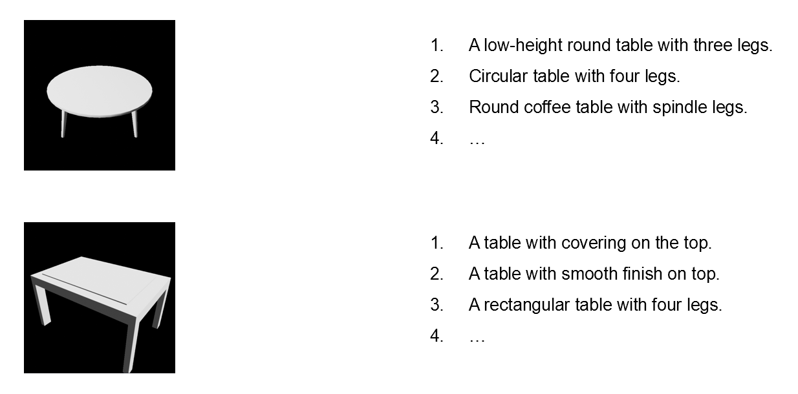

Example of our new version of Text2Shape Dataset

# Text2Shape Dataset (Ours version)

## Description

[Text2Shape dataset](http://text2shape.stanford.edu/) is a large 75K dataset of natural language descriptions for physical 3D objects in the ShapeNet dataset

Especially, we use ShapeNetCore.v2 dataset (containing "chair" and "table" categories) for our dataset. 

Our dataset is a special version of it, which each caption is a geometrically detailed description of a 3D shape, without color/texture/material information. 

Our dataset includes 15k 3D shapes, 60 (30 RGB + 30 depth) uniformly captured images per shape, and 5 captions in average (2~20 captions) per shape.

## Task

Our task is **image captioning**, which we target to obtain a geometrically detailed description of an image. 

## Metrics

Models are typically evaluated according to a [BLEU](https://aclanthology.org/P02-1040/) or [CIDER](https://www.cv-foundation.org/openaccess/content_cvpr_2015/papers/Vedantam_CIDEr_Consensus-Based_Image_2015_CVPR_paper.pdf) metric, which is similar to other captions tasks. 

## References

* [ShapeNet Dataset](https://shapenet.org/)
* [Text2Shape Dataset](http://text2shape.stanford.edu/)